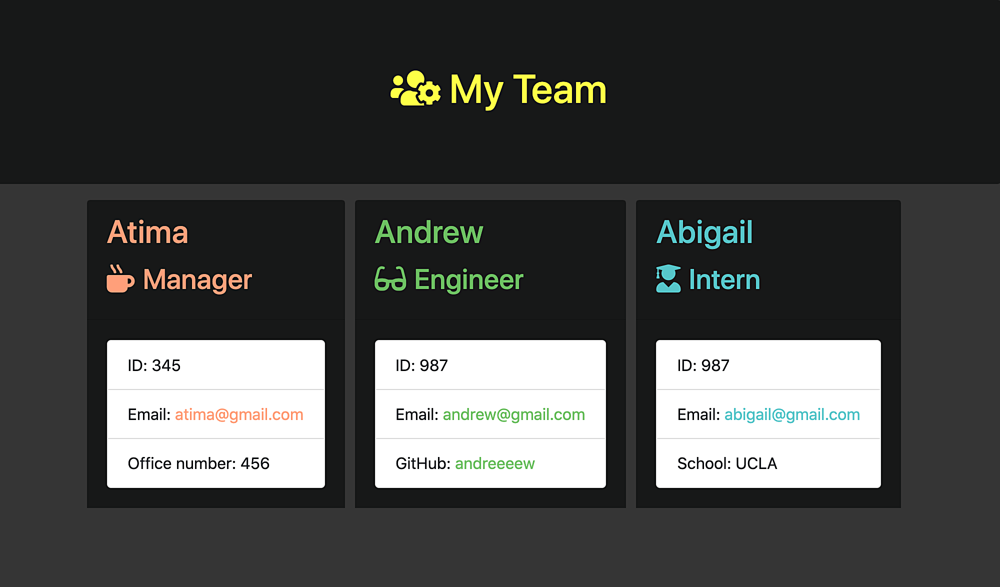

# Employee Generator

This project I build a Node CLI that takes in information about employees and generates an HTML webpage that displays summaries for each person using the [Inquirer package](https://www.npmjs.com/package/inquirer) and [jest](https://jestjs.io/) for running the provided tests.

## Table of Contents
* [Instructions](#instructions)
* [Installation](#installation)
* [Usage](#usage)
* [Tests](#tests)

## Instructions
The application will prompt the user for information about the team manager and then information about the team members. The user can input any number of team members, and they may be a mix of engineers and interns. When the user has completed building the team, the application will create an HTML file that displays a nicely formatted team roster based on the information provided by the user.

## Installation
To install the necessary dependencies, run the following command.
   - Clone [Employee Generator Repository](https://github.com/AtimaB/Employee-Generator.git)
   - Run `npm install inquirer`  and  `npm install --save-dev jest`.

## Usage
  Type `node app.js` in console and follow all the questions to create the team, once the user answered all the questions, `team.html` file will be created into output folder.

## Tests

